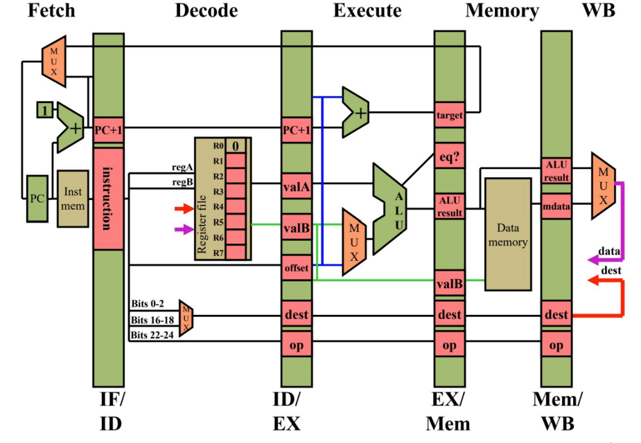

# RISC-V 5 Stage Pipelined In-Order Processor

This is the repository for a 5-stage, pipelined, synthesizable, RISC-V
processor. This pipeline supports a RV32 subset of RISC-V assembly instructions,
with potential future improvements of fully supporting every RISC-V instructions.

This pipeline also supports structural & control hazard management, data forwarding logic, 
and data hazard management.

An overview of the 5-stage pipelined processor:




### Project Files


The pipeline is broken up into 9 files in the `verilog/`
folder. There are 2 headers: `sys_defs.svh` defines data structures and
typedefs, and `ISA.svh` define decoding information used by the ID
stage. There are 5 files for the pipeline stages:
`stage_{if,id,ex,mem,wb}.sv`. The register file is in `regfile.sv` and
is instantiated inside the ID stage. Finally, the stages are tied
together by the cpu module in `cpu.sv`.

The `sys_defs.svh` file contains all of the `typedef`s and `define`s
that are used in the pipeline and testbench. The testbench and
associated non-synthesizable verilog can be found in the `test/`
folder. Note that the memory module defined in `test/mem.sv` is
not synthesizable.


## Makefile Target Reference

To run a program on the processor, run `make <my_program>.out`. This
will assemble a RISC-V `*.mem` file which will be loaded into `mem.sv`
by the testbench, and will also compile the processor and run the
program.

All of the "`<my_program>.abc`" targets are linked to do both the
executable compilation step and the `.mem` compilation steps if
necessary, so you can run each without needing to run anything else
first.

`make <my_program>.out` should be your main command for running
programs: it creates the `<my_program>.out`, `<my_program>.cpi`,
`<my_program>.wb`, and `<my_program>.ppln` output, CPI, writeback, and
pipeline output files in the `output/` directory. The output file
includes the processor status and the final state of memory, the CPI
file contains the total runtime and CPI calculation, the writeback file
is the list of writes to registers done by the program, and the pipeline
file is the state of each of the pipeline stages as the program is run.

The following Makefile rules are available to run programs on the
processor:

```
# ---- Program Execution ---- #
# These are your main commands for running programs and generating output
make <my_program>.out      <- run a program on simv
                              output *.out, *.cpi, *.wb, and *.ppln files
make <my_program>.syn.out  <- run a program on syn.simv and do the same

# ---- Executable Compilation ---- #
make build/simv      <- compiles simv from the TESTBENCH and SOURCES
make build/syn.simv  <- compiles syn.simv from TESTBENCH and SYNTH_FILES
make synth/cpu.vg    <- synthesize modules in SOURCES for use in syn.simv
make slack           <- grep the slack status of any synthesized modules

# ---- Program Memory Compilation ---- #
# Programs to run are in the programs/ directory
make programs/mem/<my_program>.mem  <- compile a program to a RISC-V memory file
make compile_all                    <- compile every program at once (in parallel with -j)

# ---- Dump Files ---- #
make <my_program>.dump  <- disassembles compiled memory into RISC-V assembly dump files
make *.debug.dump       <- for a .c program, creates dump files with a debug flag
make dump_all           <- create all dump files at once (in parallel with -j)

# ---- Verdi ---- #
make <my_program>.verdi     <- run a program in verdi via simv
make <my_program>.syn.verdi <- run a program in verdi via syn.simv

# ---- Visual Debugger ---- #
make <my_program>.vis  <- run a program on the project 3 vtuber visual debugger!
make build/vis.simv    <- compile the vtuber executable from VTUBER and SOURCES

# ---- Cleanup ---- #
make clean            <- remove per-run files and compiled executable files
make nuke             <- remove all files created from make rules
```
